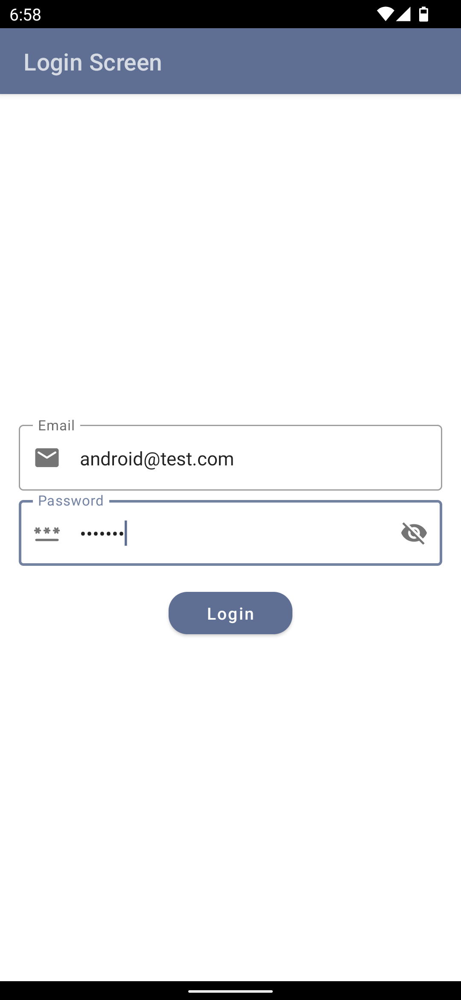
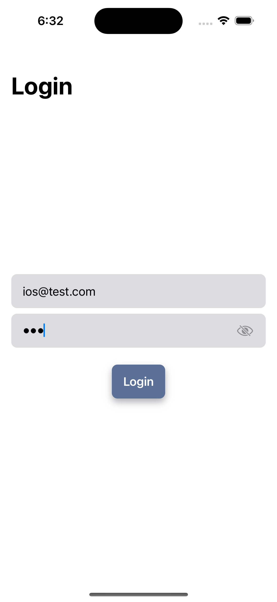

# kmm-self-learning

This is a kotlin multi-platform mobile practice project.

## What I learned?
- Basics of KMM
- Implementing Parcelable in shared module
- Custom Rating Bar and HorizontalPager in Jetpack Compose and SwiftUI
- CircularProgressBar in SwiftUI

## Screenshots

#### Login Screen
 

#### Product List Screen
 

#### Product Details Screen
 
